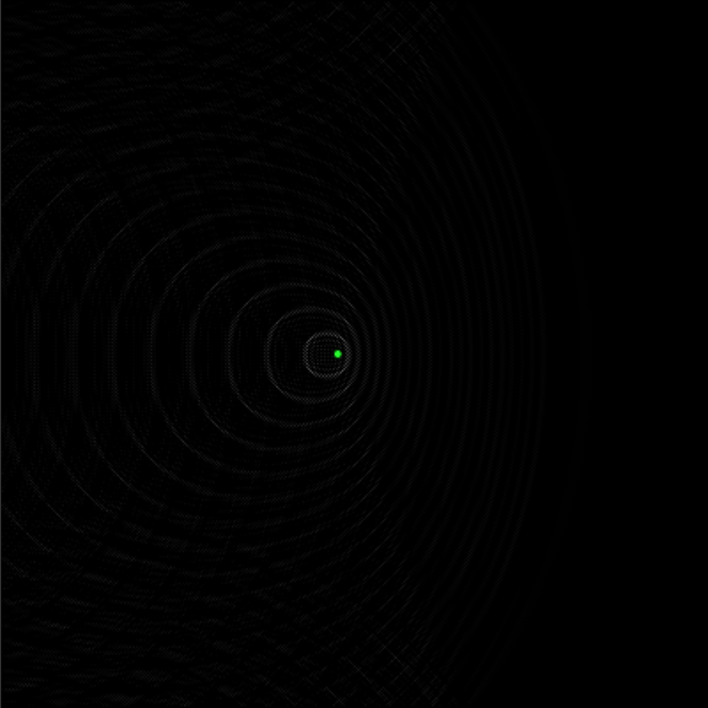
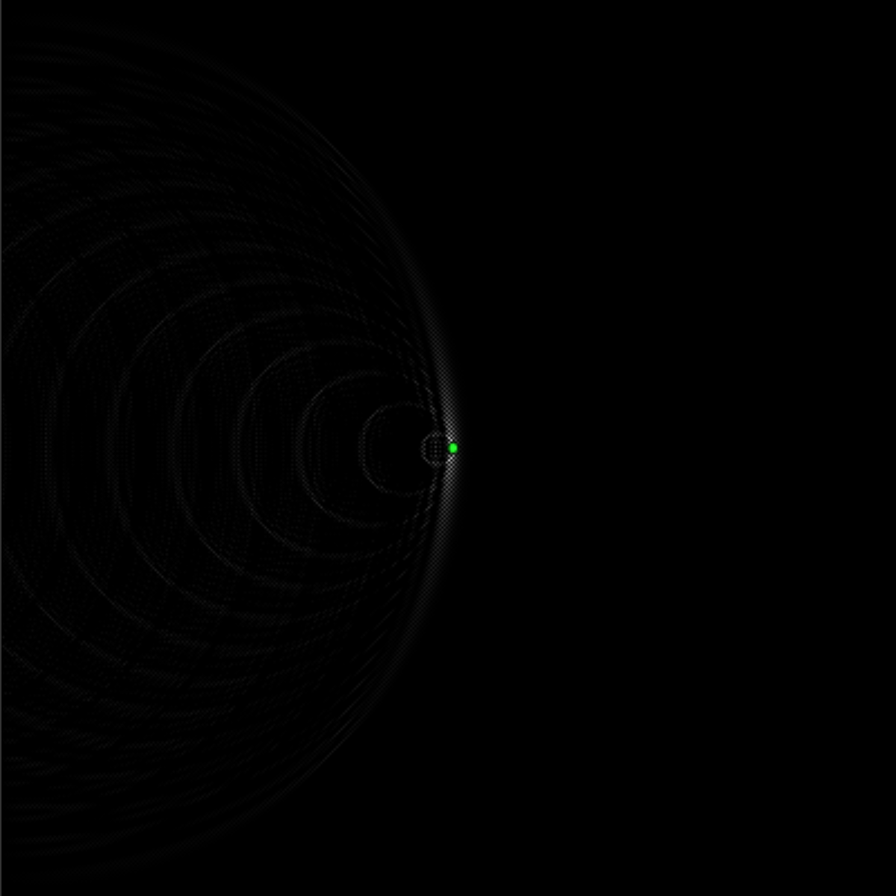
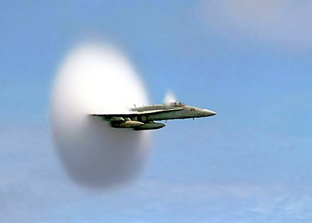
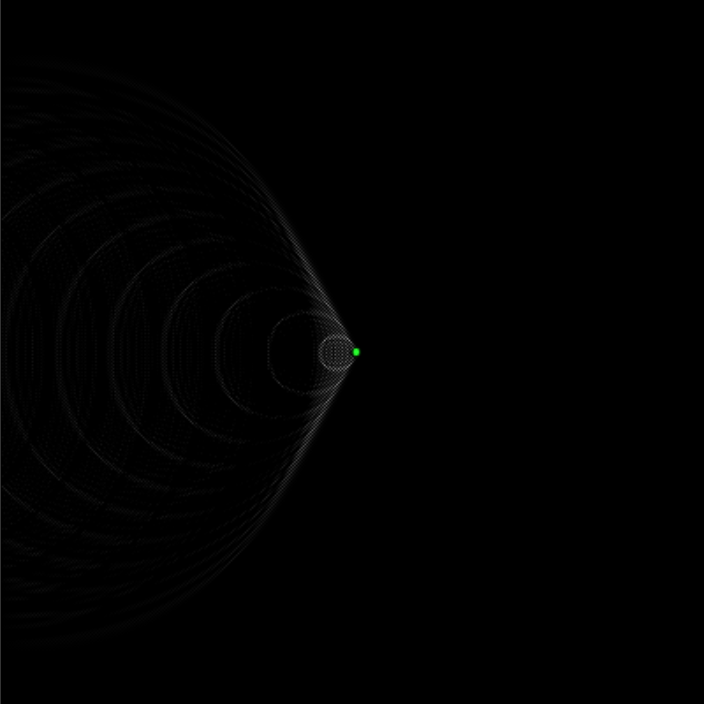
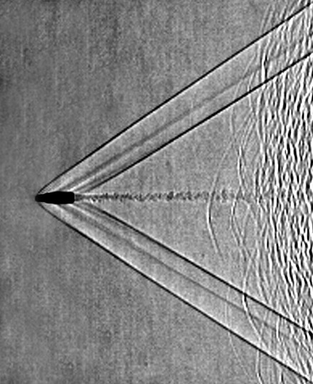

# Sound Wave Simulator

### This sound wave simulator is able to visualize phenomena which occur below, at and above the speed of sound

Made with JavaScript and visualized with the p5.js library

  This wave simulation uses the algorithm from the article linked to at the bottom and renders using pixel value manipulation. The rings represent peaks of the waves which reflect off the sides of the canvas. This can simulate any type of wave such as a water wave but I looked at it in terms of a sound wave. This can visualize many phenomena of sound waves.

---

### Subsonic

At subsonic speeds, the **Doppler Effect** can be visualized. When the sprite moves at a speed slower than the waves, the waves that build up in front of the sprite are closer together than those behind the sprite. In other words, the frequency of the waves in front of the sprite are higher than those behind. When a car passes by, we hear the pitch of the sound the car makes drop. THis is because the car is moving much like the sprite moves which causes the sound waves in front of the car to have a higher frequency and thus pitch than the waves behind.

When the sprite moves at the speed of the wave, a pressure wave can be seen. In front of the sprite there is a collection of all the peaks of the waves which forms a pressure wave. This is also known as a shock wave and creates the sonic boom sound in fighter jets.

When the sprite moves faster than the speed of sound, the pressure wave trails the sprite. This is similar to when a jet or a bullet travels faster than the speed of sound.

 
 
 

Sources:  Wave simulation: https://web.archive.org/web/20160418004149/http://freespace.virgin.net/hugo.elias/graphics/x_water.htm  Shock waves: https://en.wikipedia.org/wiki/Shock_wave   Sound barrier: https://en.wikipedia.org/wiki/Sound_barrier
